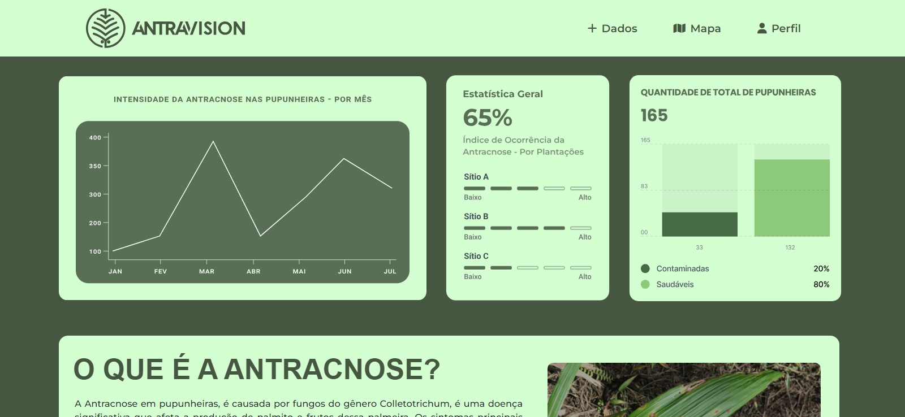

# Projeto Integrador 3º SEMESTRE

O Antravision é um sistema de detecção de antracnose em pupunheiras com uma abordagem inovadora para identificar e monitorar a presença da doença em plantações de pupunheiras. Ele combina tecnologias avançadas de sensoriamento remoto, como imagens de drones equipados com câmeras de alta resolução, com técnicas de análise de imagem.

## Integrantes
- Leticia Sayuri Imasato
- Gabriel Henrique Rodrigues de Salles
- Nicolle Vitalino Fujii
- Ana Luisa Lima

## Screenshots
- Tela Principal

- Tela do Mapa
.png)

- Tela do Perfil do Usuário
.png)
